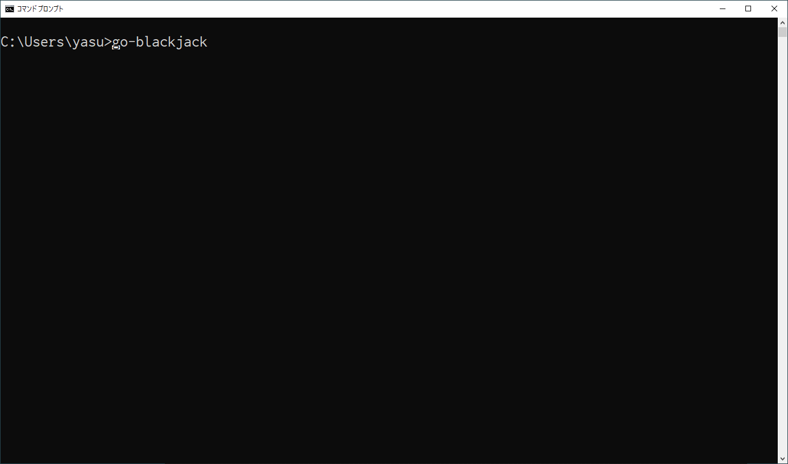

# go-blackjack



## このプロジェクトについて

> **NOTE** こちらの方が書いた[Qiita記事](https://qiita.com/hirossyi73/items/cf8648c31898216312e5)を参照

### cardlib

今回のプロジェクトにあわせて、Go実装のカードライブラリ [cardlib](https://github.com/yasukotelin/cardlib) を作った。

### Blackjackのルール

[Wikipedia](https://ja.wikipedia.org/wiki/%E3%83%96%E3%83%A9%E3%83%83%E3%82%AF%E3%82%B8%E3%83%A3%E3%83%83%E3%82%AF)を参照

### 実装する上での特殊事項

- Aは1としてのみ扱う
- 特別ルール（スプリット、ダブルダウンなど）は実装しない

## 遊び方

### インストール

```bash
go get github.com/yasukotelin/go-blackjack
```

### 実行

```bash
go-blackjack
```

対戦は先に3回勝ったほうが勝ちというルールにしています。

何度もトライしてディーラー（ゴッファー君）に勝とう！